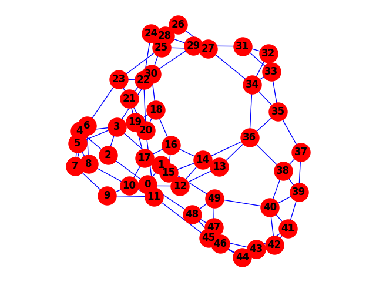
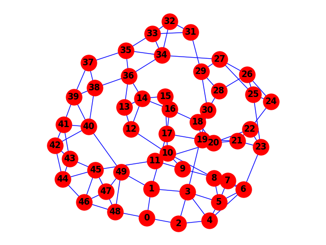

## Optimal Graph Visualization using BFGS

Depicting graphs in a well-structured manner is important, as some properties of a graph can be first detected by visual inspection, aiding clarity in reading the graph’s logical layout. We devise an algorithm that processes a graph input and generates an output with uniformly spaced elements, enhancing clarity and readability. This approach involves the optimization of a graph’s layout by minimizing a specifically defined energy function, which ensures consistent spacing and alignment within the graph’s representation

<figure>
  
  <figcaption>Randomly visualized plot.</figcaption>
</figure>

<figure>
  
  <figcaption>Optimally visualized plot.</figcaption>
</figure>